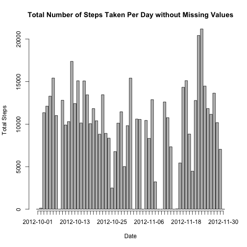
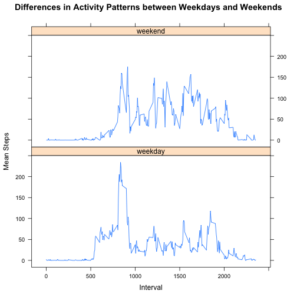

# Peer Assessment 1 for Reproducible Research
by Weifeng Zhang

## Introduction

This document is created to fulfill the peer assessment 1 of the Coursera course, *Reproducible Research* which is delivered by Johns Hopkins University. According the instruction, the data derived from a personal activity monitoring device will be analysed to answer several questions.

## Getting the Data

The data is provided as a ZIP package [here](https://d396qusza40orc.cloudfront.net/repdata%2Fdata%2Factivity.zip). Download it and extract the content into the working directory of R language.

The dataset is stored in a comma-separated-value file, whose file name is *activity.csv*, including 17,568 observations totally and 3 variables for each observations as below:

- **steps**: Number of steps taking in a 5-minute interval (missing values are coded as `NA`).

- **date**: The date on which the measurement was taken in YYYY-MM-DD format.

- **interval**: Identifier for the 5-minute interval in which measurement was taken.

## Loading and Preprocessing the Data

Load the data file into a data frame with the suitable format.


```r
dataset <- read.csv("activity.csv", na.strings = "NA", 
                    colClasses = c("numeric", "factor", "numeric"))
```

## What is mean total number of steps taken per day?

Calculate the sums of steps taken per day and make a histogram.


```r
total <- aggregate(dataset[ , 1], list(dataset$date), sum)
names(total) <- c("date", "totalsteps")
barplot(total$totalsteps, axis.lty = 1, names.arg = total$date, 
        xlab = "Date", ylab = "Total Steps", 
        main = "Total Number of Steps Taken Per Day")
```

 

Calculate the mean total number of steps taken per day.


```r
mean(total$totalsteps, na.rm = TRUE)
```

```
## [1] 10766
```

Calculate the median total number of steps taken per day.


```r
median(total$totalsteps, na.rm = TRUE)
```

```
## [1] 10765
```

## What is the average daily activity pattern?

Calculate the mean of steps according the interval and make a time serious plot.


```r
daily <- aggregate(dataset[ , 1], list(dataset$interval), mean, na.rm = TRUE)
names(daily) <- c("interval", "meansteps")
plot(daily$interval, daily$meansteps, type = "l", 
     xlab = "Interval", ylab = "Mean Steps", 
     main = "Average Number of Steps across All Days")
```

 

Then, which 5-minute interval contains the maximum number of steps?


```r
daily[daily$meansteps == max(daily$meansteps), ]$interval
```

```
## [1] 835
```

## Imputing missing values

Calculate the total number of missing values (i.e. `NA`) in the dataset.


```r
nrow(dataset[dataset$steps == "NA", ])
```

```
## [1] 2304
```

The mean of steps on the corresponding day will be filled in the missing value, creating a new data frame without missing values. If the value is still `NaN`, zero will be filled.


```r
newdataset <- dataset
mean <- aggregate(newdataset[ , 1], list(newdataset$date), mean, na.rm = TRUE)
for(i in 1:nrow(newdataset)){
    if(is.na(newdataset[i, 1])){
        newdataset[i, 1] <- mean[mean[ , 1] == newdataset[i, 2], ][1, 2]
    }
}
for(i in 1:nrow(newdataset)){
    if(is.na(newdataset[i, 1])){
        newdataset[i, 1] <- 0
    }
}
```

Recalculate the sums of steps taken per day and make a histogram.


```r
newtotal <- aggregate(newdataset[ , 1], list(newdataset$date), sum)
names(newtotal) <- c("date", "totalsteps")
barplot(newtotal$totalsteps, axis.lty = 1, names.arg = newtotal$date, 
        xlab = "Date", ylab = "Total Steps", 
        main = "Total Number of Steps Taken Per Day without Missing Values")
```

 

And recalculate the mean total number of steps taken per day.


```r
mean(newtotal$totalsteps)
```

```
## [1] 9354
```

Recalculate the median total number of steps taken per day.


```r
median(newtotal$totalsteps)
```

```
## [1] 10395
```

Obviously, the mean and the median of total steps per day both decrease after replacing missing values with the mean of steps on the corresponding day.

## Are there differences in activity patterns between weekdays and weekends?

Create a new factor variable in which indicates whether the corresponding date is a weekday or weekend day.


```r
dataset <- cbind(dataset, "weekday", stringsAsFactors = FALSE)
names(dataset)[4] <- "weekday"
for(i in 1:nrow(dataset)){
    weekday <- weekdays(as.Date(dataset[i, 2]))
    if(weekday %in% c("星期六", "星期日")){
        dataset[i, 4] <- "weekend"
    }
}
dataset[ , 4] <- as.factor(dataset[ , 4])
```

Calculate the mean of steps per weekday and weekend, and make a panel plot.


```r
meanbyweekday <- split(dataset, dataset$weekday)
meanbyweekday[[1]] <- aggregate(meanbyweekday[[1]][ , 1], 
                                list(meanbyweekday[[1]][ , 3]), mean, 
                                na.rm = TRUE)
meanbyweekday[[2]] <- aggregate(meanbyweekday[[2]][ , 1], 
                                list(meanbyweekday[[2]][ , 3]), mean, 
                                na.rm = TRUE)
meanbyweekday <- rbind(meanbyweekday[[1]], meanbyweekday[[2]])
meanbyweekday <- cbind(meanbyweekday, rep(c("weekday", "weekend"), each = 288))
names(meanbyweekday) <- c("interval", "meansteps", "weekday")
library(lattice)
xyplot(meansteps ~ interval | weekday, data = meanbyweekday, 
       type = "l", layout = c(1, 2), xlab = "Interval", ylab = "Mean Steps", 
       main = "Differences in Activity Patterns between Weekdays and Weekends")
```

 
