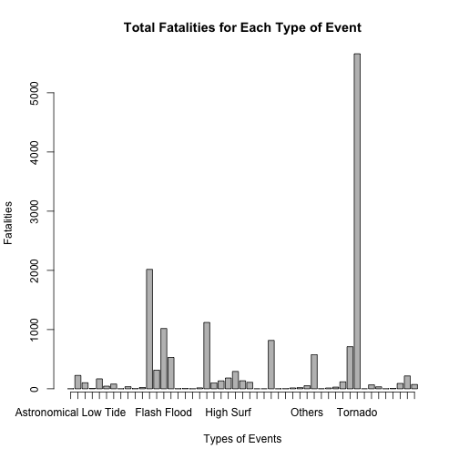
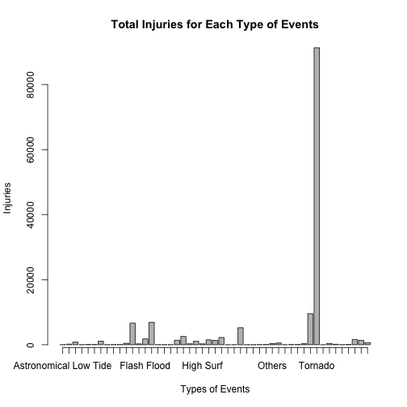
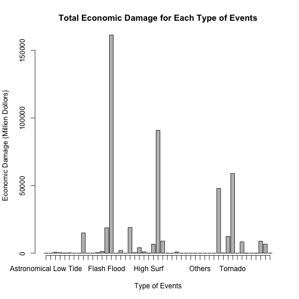

# Peer Assessment 2 for Reproducile Research: Analysis of Storm Data

by Weifeng Zhang

## Introduction

Storms and other severe weather events usually cause both public health and economic loss, such as fatalities, injuries, property, and crop damage. Therefore, it's believed that it help to avoid the outcomes to know about which type of weather events is the most harmful, no matter to population health or economic consequences.

This report involves an exploratory analysis of the storm database, named "*Storm Data*" provided by the U.S. National Oceanic and Atmospheric Administration's (NOAA). This database tracks characteristics of major storms and weather events in the United States, including when and where they occur, as well as estimates of any fatalities, injuries, and property damage.

The whole course of the analysis is described in this report, which contains three sections:

1. Getting Raw Data.
2. Processing Data. Clean the raw data for the following analysis.
3. Results. Address the questions with the processed dataset.
4. Software Environment for Analysis.

This analysis is performed with R language.

## Getting Raw Data

The raw data is a part of the National Weather Service, recording the relative events from 1951 to Nov., 2011. The raw data come in the form of a comma-separated-value file (.csv) compressed via the bzip2 algorithm (.bz2). And it can be downloaded from [here](https://d396qusza40orc.cloudfront.net/repdata%2Fdata%2FStormData.csv.bz2).

There is some documentation of the database which contains how to define or construct the variables.

- [Storm Data Documentation](https://d396qusza40orc.cloudfront.net/repdata%2Fpeer2_doc%2Fpd01016005curr.pdf), provided by National Weather Service.
- [Storm Events FAQ](https://d396qusza40orc.cloudfront.net/repdata%2Fpeer2_doc%2FNCDC%20Storm%20Events-FAQ%20Page.pdf), provided by National Climatic Data Center.


```r
fileurl <- "https://d396qusza40orc.cloudfront.net/repdata%2Fdata%2FStormData.csv.bz2"
filename <- "stormdata.csv.bz2"
download.file(fileurl, filename, method = "curl")
```

## Processing Data

Read the raw data as a data frame with R language and create an independent data frame for analysis per se the requirement of the assignment.


```r
rawdata <- read.csv(bzfile(filename), stringsAsFactors = FALSE)

## Extract the variables including EVTYPE, FATALITIES, INJURIES, PROPDMG, 
## PROPDMGEXP, CROPDMG, CROPDMGEXP.

extract <- c(eventtype = 8, fatalities = 23, injuries = 24, 
             propertydamage = 25, propertydamageexp = 26, cropdamage = 27, 
             cropdamageexp = 28)
dataset <- rawdata[extract]
names(dataset) <- names(extract)

## Remove the rows that have 0 in all four variables.

dataset <- dataset[!(dataset$fatalities == 0 & dataset$injuries == 0 
                   & dataset$propertydamage == 0 & dataset$cropdamage == 0), ]
```

Calculate the actual number of property and crop damage in the corresponding columns.


```r
factor <- as.factor(dataset$propertydamageexp)
levels(factor) <- c(1, 1, 1, 1, 100, 1000, 10000, 100000, 1000000, 
                    10000000, 1000000000, 100, 100, 1000, 1000000, 1000000)
dataset$propertydamage <- dataset$propertydamage * 
    as.numeric(as.character(factor))
factor <- as.factor(dataset$cropdamageexp)
levels(factor) <- c(1, 1, 1, 1000000000, 1000, 1000, 1000000, 1000000)
dataset$cropdamage <- dataset$cropdamage * as.numeric(as.character(factor))
dataset <- dataset[c(1, 2, 3, 4, 6)]
```

In the *Storm Data Documentation*, 48 types of standard description for events are defined. However, there's more than 48 types of events in the dataset.


```r
length(unique(dataset$eventtype))
```

```
## [1] 488
```

Furthermore, the description of events should be trimmed to match the standard definitions. Several rules below are applied to the procedure.

- All the description of types for events are replaced with the standard description.
- All the description are replaced with the corresponding standard description according to its meanings.
- If the specific description contains more than one event, it is replaced with the preceding event. If the preceding one doesn't match any standard events, the next event is considered, and so forth.
- If no standard description can be applied, "Others" is used.
- Refer to [*trim.R*](https://github.com/WeifengSH/datasciencecoursera/blob/master/Reproducible%20Research/Assignment%202/trim.R) for more detailed corresponding relationship.


```r
source("trim.R")  ## trim.R should be placed in the working directory.
dataset$eventtype <- as.factor(trim(dataset$eventtype))
```

## Results

### Which Type of Events Is Most Harmful to Population Health?

Calculate the accumulative numbers of fatalities and injuries for each type of events. And make a panel plot to compare the results.


```r
health <- aggregate(dataset[c(2, 3)], list(dataset$eventtype), sum)
names(health)[1] <- "eventtype"
barplot(health$fatalities, axis.lty = 1, names.arg = health$eventtype, 
        xlab = "Types of Events", ylab = "Fatalities", 
        main = "Total Fatalities for Each Type of Event")
```

 

```r
barplot(health$injuries, axis.lty = 1, names.arg = health$eventtype,
        xlab = "Types of Events", ylab = "Injuries", 
        main = "Total Injuries for Each Type of Events")
```

 

According the data and the plot, the type of events which is most harmful to population health can be drawn.


```r
health[health$fatalities == max(health$fatalities), 1]
```

```
## [1] Tornado
## 49 Levels: Astronomical Low Tide Avalanche Blizzard ... Winter Weather
```

```r
max(health$fatalities)
```

```
## [1] 5659
```

```r
health[health$injuries == max(health$injuries), 1]
```

```
## [1] Tornado
## 49 Levels: Astronomical Low Tide Avalanche Blizzard ... Winter Weather
```

```r
max(health$injuries)
```

```
## [1] 91364
```

No matter regarding accumulative fatalities or injuries across the United States, **Tornado** is the most harmful type of events to population health.

### Which Type of Events Has the Greatest Economic Consequences?

Calculate the total damage which combines property damage and crop damage for each type of events. And make a plot to compare the results.


```r
dataset$totaldamage <- (dataset$propertydamage + dataset$cropdamage)/1000000
damage <- aggregate(dataset[6], list(dataset$eventtype), sum)
names(damage)[1] <- "eventtype"
barplot(damage$totaldamage, axis.lty = 1, names.arg = damage$eventtype, 
        xlab = "Type of Events", ylab = "Economic Damage (Million Dollors)", 
        main = "Total Economic Damage for Each Type of Events")
```

 

According the data and the plot, the type of events which has the greatest economic consequences can be drawn.


```r
damage[damage$totaldamage == max(damage$totaldamage), 1]
```

```
## [1] Flood
## 49 Levels: Astronomical Low Tide Avalanche Blizzard ... Winter Weather
```

```r
max(damage$totaldamage)
```

```
## [1] 161333
```

Across the United States, **Flood** is the type of events which leads to the greatest economic damage, evaluated by the sum of property and crop damage.

## Software Environment for Analysis


```r
sessionInfo()
```

```
## R version 3.0.3 (2014-03-06)
## Platform: x86_64-apple-darwin10.8.0 (64-bit)
## 
## locale:
## [1] zh_CN.UTF-8/zh_CN.UTF-8/zh_CN.UTF-8/C/zh_CN.UTF-8/zh_CN.UTF-8
## 
## attached base packages:
## [1] stats     graphics  grDevices utils     datasets  methods   base     
## 
## other attached packages:
## [1] knitr_1.6
## 
## loaded via a namespace (and not attached):
## [1] codetools_0.2-8 digest_0.6.4    evaluate_0.5.5  formatR_0.10   
## [5] stringr_0.6.2   tools_3.0.3
```
